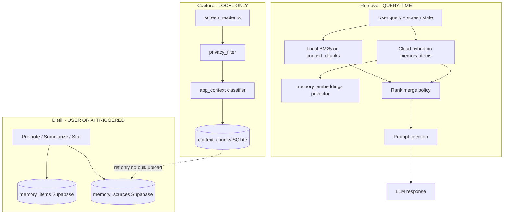
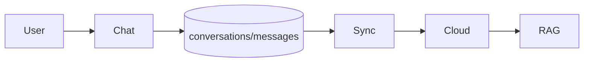

# Context Memory Architecture Review

**Project:** Torvi AI — Local-first Context Memory System  
**Date:** June 9, 2026  
**Inputs:** `docs/supabase-schema-plan.md`, `context-memory.md`, `Company-Brain.md`, current SQLite/Rust capture pipeline  
**Status:** Architecture review only — **no migrations, no code changes**

---

## Executive Summary

Torvi is architecturally a **passive context capture → local retrieval → optional knowledge distillation** system. The AI chat UI is a **consumer** of that pipeline, not the product’s data model center.

The existing Supabase schema plan (`supabase-schema-plan.md`) correctly keeps **raw context local** and introduces **`memory_items`** for distilled cloud knowledge. However, the plan still **orients around chat-app tables** (`conversations`, `prompts`, legacy Appwrite sync) and under-specifies **provenance, multi-source attribution, and future graph/scoped memory**.

### Decision

**Chosen: Option B — Add `memory_sources`**

With two refinements borrowed from an alternative layout (Option C):

1. **Re-center** the cloud schema on `memory_items` + `memory_sources` + `memory_embeddings`, not on chat metadata.
2. **Treat** `conversations` / `prompts` as **peripheral sync tables** (UX convenience), deferred below memory infrastructure in migration priority.

Option A (current schema sufficient) is **rejected** — `memory_items.source` as a single text field and `metadata` jsonb cannot support attribution, multi-source distillation, or future relationship mapping without painful migrations.

---

## 1. Product framing: Context Memory, not Chat Database

### What Torvi actually is

| Layer | Role | Storage today |
|-------|------|---------------|
| **Capture** | UIAutomation screen text, classification, PII redaction | Rust → SQLite `context_chunks` |
| **Retrieve (live)** | BM25 + recency over recent chunks | In-process JS over local DB |
| **Act** | Inject context into AI prompt; proactive chips; auto prompt switch | `ai-response.function.ts` |
| **Distill (future)** | Promote high-value observations to persistent knowledge | Not implemented → target `memory_items` |
| **Retrieve (long-term)** | Cross-device / semantic “what do I know?” | Target `memory_items` + `memory_embeddings` |
| **Chat UI** | One interaction surface among many | SQLite `conversations` / `messages` |

The chat transcript is **ephemeral working memory**. The second brain is **distilled knowledge** with provenance — not message logs in Postgres.

### Architecture goals vs current plan

| Goal | Schema plan alignment | Gap |
|------|----------------------|-----|
| Raw context stays local | ✅ `context_chunks` not in Supabase | None |
| Cloud = distilled knowledge only | ✅ `memory_items` concept | ⚠️ Screenshot blob sync still suggested |
| Context → Memory → Retrieval | ⚠️ Partial | Chat tables still co-equal in ER diagram |
| Not Chat → Database | ❌ Partial | `conversations` sync is legacy Appwrite center of gravity |

---

## 2. Pipeline evaluation: Context → Memory → Retrieval

### Target pipeline (correct for this product)



### Wrong pipeline (chat-app centric — avoid as primary model)



**Why this is wrong for Torvi:** Message bodies are local-only today by design. Most valuable context never enters a conversation — it is **ambient screen state**. Indexing chat threads without the capture → distill step misses the core product.

### Verdict

| Question | Answer |
|----------|--------|
| Does the schema plan support Context → Memory → Retrieval? | **Partially** — local context + `memory_items` yes; provenance and retrieval merge policy underspecified |
| Is chat treated as primary? | **Too much** — `conversations`/`prompts` should be demoted in migration order and mental model |
| Is retrieval two-tier? | **Implied** but not formalized — must be explicit in implementation |

---

## 3. Local data inventory (raw context — never cloud bulk sync)

| Local artifact | Table / store | Fields relevant to provenance | TTL / volume |
|----------------|---------------|------------------------------|--------------|
| Screen / a11y text chunks | `context_chunks` | `app_name`, `window_title`, `content_type`, `url`, `content_hash`, `captured_at`, `parent_capture_id`, `chunk_index` | 24h prune; high volume |
| Screenshot binary | `screenshots` | `image_data`, `prompt`, `captured_at` | Unbounded locally |
| Meeting-ish content | `context_chunks` where `content_type=meeting` | Same as chunks | 24h unless promoted |
| OCR output | Inside `text_content` of chunks | — | Never leaves device unless distilled |
| Chat messages | `messages` | `conversation_id`, `role`, `content` | Local-first |
| STT / listening | Ephemeral streams | — | Not persisted as transcripts today |

**Rule:** Cloud receives **references** to local sources (`source_ref = chunk_id`) and **optional short excerpts** — never full raw capture streams.

---

## 4. Cloud data inventory (distilled knowledge)

| Knowledge class | Examples | Target table |
|-----------------|----------|--------------|
| Starred observation | User pins a code block from context UI | `memory_items` |
| Screenshot insight | AI summary of a screen region | `memory_items` + optional Storage thumbnail |
| Extracted insight | “Refund policy requires manager approval” | `memory_items` |
| Saved preference | Model, language (not memory — settings) | `settings` |
| Named instruction library | System prompt presets | `prompts` (or fold into settings) |
| Billing / identity | Plan, usage | `profiles`, `usage` |

**Chat conversation metadata** is cross-device **UI state**, not knowledge. Keep `conversations` if needed for sidebar sync; do not conflate with `memory_items`.

---

## 5. `memory_items` design review

### Current plan (from `supabase-schema-plan.md`)

```
memory_items: content, summary, memory_type, importance, source (text),
              source_app, source_url, content_hash, metadata jsonb
```

### Strengths

- Separates distilled `content` from `summary` (good for injection vs display)
- `importance` supports ranking
- `memory_type` enables filtered retrieval
- `content_hash` supports dedup
- Soft delete for sync

### Weaknesses for a context-memory system

| Gap | Impact |
|-----|--------|
| Single `source` text field | Cannot represent multi-chunk distillation or connector + screen sources |
| `source_app` / `source_url` on item | Duplicated when multiple sources; conflates item with source |
| `memory_type` mixes **origin** and **ontology** | e.g. `screenshot` vs `insight` vs `connector` — different axes |
| No `scope` dimension | Blocks project / company / team memory |
| No link table for relationships | Blocks “related memories” graph (Company Brain Phase 3) |
| `metadata` jsonb as catch-all | Provenance becomes unqueryable |
| No `confirmed_at` / staleness | Blocks institutional memory freshness tracking |
| Local `context_chunk` ref buried in metadata | Not first-class; breaks cross-device explainability |

### Recommended `memory_items` shape (revision — for next schema doc)

Split **what the memory is** from **where it came from**:

| Column | Purpose |
|--------|---------|
| `id`, `user_id` | Identity |
| `content`, `summary` | Distilled knowledge body |
| `knowledge_type` | `fact`, `procedure`, `decision`, `reference`, `preference`, `event` (ontology) |
| `domain` | `code`, `meeting`, `email`, `browser`, `people`, `project`, `company` (retrieval facet) |
| `importance` | 1–10 rank |
| `scope_type` | `personal` \| `project` \| `workspace` (future company) |
| `scope_id` | Nullable UUID — project or workspace FK when scoped |
| `content_hash` | Dedup of distilled content |
| `confirmed_at` | Last human or system confirmation (staleness) |
| `created_at`, `updated_at`, `deleted_at` | Sync |

**Move to `memory_sources`:** `source_app`, `source_url`, `window_title`, `content_type`, `captured_at`, connector IDs, local chunk refs.

**Deprecate on item:** flat `source` text (replace with primary source via join or `primary_source_id`).

---

## 6. Should we add `memory_sources`?

### Yes — Option B

`memory_sources` models **provenance edges**: “this memory was derived from these observations.”

#### Proposed `memory_sources` table

| Column | Type | Purpose |
|--------|------|---------|
| `id` | `uuid` PK | |
| `memory_id` | `uuid` FK → `memory_items` ON DELETE CASCADE | Parent distilled memory |
| `user_id` | `uuid` FK → `auth.users` | RLS convenience |
| `source_kind` | `text` | `local_chunk`, `screen_capture`, `screenshot`, `chat_excerpt`, `meeting`, `browser_tab`, `connector` |
| `source_ref` | `text` NULL | Opaque **local** ID (e.g. `context_chunks.id`) — not content |
| `connector` | `text` NULL | `slack`, `notion`, `gmail`, … when `source_kind=connector` |
| `connector_ref` | `text` NULL | External stable ID (thread TS, page ID) |
| `app_name` | `text` NULL | From capture pipeline |
| `window_title` | `text` NULL | |
| `content_type` | `text` NULL | `code`, `meeting`, … |
| `url` | `text` NULL | Browser / doc URL |
| `captured_at` | `timestamptz` NULL | When source was observed |
| `excerpt` | `text` NULL | Short user-approved slice (≤2k chars), not full raw capture |
| `metadata` | `jsonb` | Extensible connector payload |
| `created_at` | `timestamptz` | |

**Indexes:**

- `(memory_id)` — list sources for a memory
- `(user_id, source_kind, captured_at DESC)` — timeline queries
- `(user_id, connector, connector_ref)` — “all memories from this Slack thread”
- `(user_id, source_ref)` WHERE `source_ref IS NOT NULL` — local chunk backlink (device-specific)

**RLS:** `auth.uid() = user_id` for all operations on own rows.

#### Cardinality

- **1 memory : N sources** — e.g. meeting memory distilled from 12 chunks + 1 calendar connector ref
- **1 source : N memories** (over time) — same chunk promoted twice after edit → two memories, same `source_ref`

#### What stays local

- Full `text_content` of `context_chunks`
- Screenshot `image_data` binary
- `source_ref` is meaningful **only on the device that captured it** unless future sync assigns global capture IDs

Cross-device: cloud stores distilled `content` + connector refs; local ref is best-effort for “show original context” on same machine.

---

## 7. Future features fit

| Feature | Requires | Fit with Option B |
|---------|----------|-------------------|
| **Semantic search** | `memory_embeddings` + optional `tsvector` on `memory_items` | ✅ Unchanged; embed distilled content, not raw chunks |
| **Project memory** | `memory_items.scope_type=project`, `scope_id` + table `projects` (later) | ✅ Add scope columns on items |
| **People memory** | `domain=people` + future `memory_entities` or `metadata.person_id` | ⚠️ Phase 2 — entity table optional |
| **Company memory** | `scope_type=workspace`, org RLS, shared workspace_id | ⚠️ Phase 2 — `workspaces` + membership |
| **Meeting memory** | `domain=meeting`, sources with `content_type=meeting` | ✅ `memory_sources.content_type` |
| **Browser memory** | `source_kind=browser_tab`, `url` on sources | ✅ |
| **Cross-device sync** | Cloud-authoritative `memory_items` + sources + embeddings | ✅ Local chunks do **not** sync |

### Optional Phase 3 tables (not v1 migrations)

| Table | When | Purpose |
|-------|------|---------|
| `memory_links` | Graph retrieval | `from_memory_id`, `to_memory_id`, `link_type` (`supports`, `contradicts`, `supersedes`) |
| `memory_entities` | People/project linking | Canonical entities extracted from memories |
| `workspaces` / `projects` | Company Brain Phase 1 | Scope for shared memory |

Do **not** add these in first migration — design `memory_sources` so they extend cleanly.

---

## 8. Retrieval architecture (formal recommendation)

### Two-tier retrieval (required)

| Tier | Corpus | Algorithm | When used |
|------|--------|-----------|-----------|
| **L0 Live** | `context_chunks` (local) | BM25 + recency | Every AI request; “what’s on screen now” |
| **L1 Long-term** | `memory_items` (cloud) | tsvector + pgvector hybrid | “What do I know about X?” cross-session/device |
| **L2 Graph** (future) | `memory_links` | Graph walk + vector | Company Brain structured knowledge |

### Merge policy (query time)

```
1. Always run L0 if chunks exist in last 30 min
2. Run L1 if query is conceptual OR no strong L0 match (BM25 top < threshold)
3. Inject L0 blocks under "## Current Screen Context"
4. Inject L1 blocks under "## Relevant Memories"
5. Cap tokens separately — L0 priority for code-heavy sessions
```

Local-first means **L0 wins ties** for recency; cloud wins for historical facts user explicitly saved.

---

## 9. Chat tables: demote, don’t delete (yet)

| Table | Role in context-memory architecture | Migration priority |
|-------|--------------------------------------|-------------------|
| `profiles`, `usage` | Account/billing — necessary | P0 |
| `settings` | User preferences — necessary | P1 |
| **`memory_items`** | **Core product cloud store** | **P0 for memory vision** |
| **`memory_sources`** | **Core provenance** | **P0 with memory_items** |
| `memory_embeddings` | Semantic L1 retrieval | P2 |
| `conversations` | Sidebar sync — peripheral | P3 (can keep Appwrite longer) |
| `prompts` | Prompt library — peripheral | P3 |
| `messages` | Optional backup — not v1 | P4 or never |

---

## 10. Comparison of options

### Option A — Current schema sufficient

**Reject.**

- Single `source` text + jsonb `metadata` will not support multi-source provenance, connector attribution, or graph edges without schema churn.
- Conflates knowledge type with capture source in `memory_type`.
- ER diagram overweights chat.

### Option B — Add `memory_sources` ✅ **SELECTED**

**Accept** with `memory_items` column refinements (`knowledge_type`, `domain`, `scope_*`; move attribution to sources).

Adds minimal tables, maximal clarity for Context → Memory → Retrieval.

### Option C — Alternative architecture

Full alternative would be:

- **Knowledge graph center:** `memories` + `sources` + `links` + `entities` + `scopes` from day one
- **Demote** chat tables to local-only indefinitely
- **Event-sourced capture log** locally with promotion events

**Verdict:** Option C is the **north star** (Company Brain Phase 3+). Option B is the **right v1 step** — implements provenance without premature graph/entity complexity.

---

## 11. Revised cloud ER (recommended)

```mermaid
erDiagram
    auth_users ||--o{ memory_items : owns
    auth_users ||--o{ memory_sources : owns
    memory_items ||--o{ memory_sources : derived_from
    memory_items ||--o| memory_embeddings : embedded
    memory_items ||--o{ memory_links : links_from
    memory_items ||--o{ memory_links : links_to

    auth_users ||--|| profiles : id
    auth_users ||--|| usage : user_id
    auth_users ||--o| settings : user_id

    memory_items {
        uuid id PK
        uuid user_id FK
        text content
        text summary
        text knowledge_type
        text domain
        text scope_type
        uuid scope_id
        smallint importance
    }

    memory_sources {
        uuid id PK
        uuid memory_id FK
        text source_kind
        text source_ref
        text app_name
        text url
        timestamptz captured_at
        text excerpt
    }

    memory_embeddings {
        uuid memory_id PK_FK
        vector embedding
    }
```

`conversations` / `prompts` omitted from core diagram intentionally.

---

## 12. Sync strategy (context-memory aligned)

| Event | Local | Cloud |
|-------|-------|-------|
| Context captured | Insert `context_chunks` | **Nothing** |
| User stars / saves memory | Optional local cache row | Insert `memory_items` + `memory_sources` |
| AI suggests “save this insight?” | — | User confirms → distill |
| Screenshot analyzed | SQLite `screenshots` | Opt-in: `memory_items` + summary + `source_kind=screenshot` |
| Chat message pinned | Local message ref | `memory_items` + `source_kind=chat_excerpt` |
| Sign-in | Pull `memory_items` (+ sources) last 90d | Authoritative for L1 |
| Same chunk re-promoted | New local action | New memory or update with new source row |

**Never:** batch upload `context_chunks` on timer or sign-in.

---

## 13. Migration risks (memory-specific)

| Risk | Severity | Mitigation |
|------|----------|------------|
| Users expect chat history in cloud | Medium | Messaging: “memories sync, raw screen context does not” |
| `source_ref` invalid on other devices | Expected | UI: “Captured on another device” when ref missing locally |
| Over-distillation uploads PII | High | Distillation step runs same redaction rules as `privacy_filter.rs` |
| `memory_sources` row explosion | Medium | Cap sources per memory (e.g. 20); roll up chunk captures |
| Scope/workspaces premature | Low | Default `scope_type=personal`; nullable `scope_id` |
| Embedding distilled vs raw | Medium | Embed `summary` + `content`, never raw chunk text |

---

## 14. Suggested migration order (revised)

| Step | Deliverable |
|------|-------------|
| 1 | `profiles`, `usage`, RLS, `increment_usage()` RPC |
| 2 | **`memory_items` + `memory_sources`** + RLS |
| 3 | `memory_embeddings` + pgvector (can ship after items) |
| 4 | Auth + backend provider switch |
| 5 | Promotion UX (star chunk → cloud memory) |
| 6 | `settings` |
| 7 | `conversations` metadata (if still needed) |
| 8 | `prompts` |
| 9 | Optional screenshot Storage + memory row |
| 10 | `memory_links` / `workspaces` when Company Brain Phase 1 starts |

---

## 15. Action items before SQL migrations

- [ ] Update `supabase-schema-plan.md` with Option B (`memory_sources` + revised `memory_items` columns)
- [ ] Confirm `knowledge_type` vs `domain` enum lists
- [ ] Confirm promotion UX: manual only in v1 (recommended)
- [ ] Confirm screenshot cloud sync remains **opt-in**
- [ ] Defer `conversations`/`messages` cloud tables to P3 unless cross-device chat list is a launch requirement
- [ ] Document L0/L1 retrieval merge policy in `ARCHITECTURE.md`

---

## 16. Summary

Torvi’s architecture is **Context → Memory → Retrieval**, not **Chat → Database**. The existing schema plan is a workable migration bridge from Appwrite but **insufficient** for provenance-rich, multi-source, scoped memory without **`memory_sources`**.

**Option B is selected.** Implement `memory_items` (distilled knowledge nodes) + `memory_sources` (attribution edges) as the **first-class cloud pair**, keep raw capture in SQLite forever, and demote chat metadata sync to peripheral status.

**No migrations generated in this review.**
