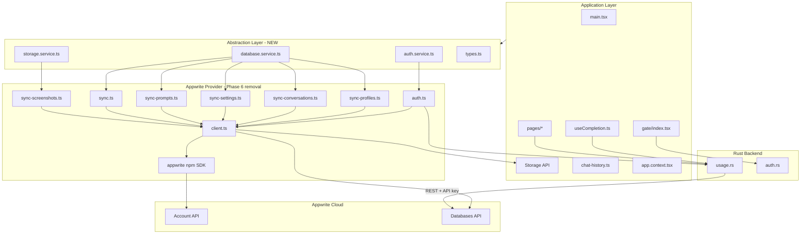

# Appwrite → Supabase Migration Report

**Project:** Torvi AI (Tauri 2 + React 19 + TypeScript + Rust)  
**Date:** June 9, 2026  
**Status:** Phase 0 complete — audit + compatibility layer. **No Supabase code yet.**

---

## Executive Summary

Torvi uses Appwrite as its cloud BaaS for **Google OAuth**, **document sync** (profiles, conversations, settings, prompts, screenshots metadata), **file storage** (screenshot images), and **server-side usage counters** (Rust REST writes with API secret). There is **no Appwrite Realtime** usage today. Legacy JWT auth via a landing page runs in parallel.

A provider-agnostic abstraction layer now lives at `src/lib/backend/`. All application code imports from there. Appwrite remains the active provider under `src/lib/appwrite/`.

---

## A. Current Appwrite Architecture

### A.1 NPM Package

| Package | Version | Location |
|---------|---------|----------|
| `appwrite` | ^24.2.0 | `package.json` dependencies |

No other Appwrite-related npm packages.

### A.2 Environment Variables

| Variable | Scope | Purpose |
|----------|-------|---------|
| `VITE_APPWRITE_ENDPOINT` | Frontend (bundled) | API base URL |
| `VITE_APPWRITE_PROJECT_ID` | Frontend (bundled) | Project identifier |
| `VITE_APPWRITE_DATABASE_ID` | Frontend (bundled) | Database ID (`torvi_db`) |
| `VITE_APPWRITE_COLLECTION_USER_PROFILES` | Frontend | Collection ID |
| `VITE_APPWRITE_COLLECTION_CONVERSATIONS` | Frontend | Collection ID |
| `VITE_APPWRITE_COLLECTION_SYSTEM_PROMPTS` | Frontend | Collection ID |
| `VITE_APPWRITE_COLLECTION_USER_SETTINGS` | Frontend | Collection ID |
| `VITE_APPWRITE_COLLECTION_SCREENSHOTS` | Frontend | Collection ID |
| `VITE_APPWRITE_COLLECTION_USER_USAGE` | Frontend | Collection ID (read-only for users) |
| `VITE_APPWRITE_BUCKET_SCREENSHOTS` | Frontend | Storage bucket ID |
| `APPWRITE_API_SECRET` | Rust only | Server API key for usage writes |

**Provisioning script:** `scripts/provision-appwrite.mjs`  
**npm script:** `npm run appwrite:provision`

### A.3 Files Using Appwrite (by layer)

#### Provider layer (internal — do not import from app code)

| File | Purpose |
|------|---------|
| `src/lib/appwrite/client.ts` | SDK init (`Client`, `Account`, `Databases`, `Storage`), env config, `pingAppwrite()` |
| `src/lib/appwrite/auth.ts` | Google OAuth URL, session create/get/logout, profile resolution |
| `src/lib/appwrite/sync-profiles.ts` | `user_profiles` upsert; `user_usage` read; plan fetch |
| `src/lib/appwrite/sync-conversations.ts` | Conversation metadata CRUD + list |
| `src/lib/appwrite/sync-settings.ts` | User settings push/pull |
| `src/lib/appwrite/sync-prompts.ts` | System prompts CRUD + list |
| `src/lib/appwrite/sync-screenshots.ts` | Screenshot image upload + metadata |
| `src/lib/appwrite/sync.ts` | `runStartupSync()` orchestration |
| `src/lib/appwrite/index.ts` | Barrel export (marked `@internal`) |

#### Abstraction layer (application entry point)

| File | Purpose |
|------|---------|
| `src/lib/backend/types.ts` | Provider-agnostic types (`BackendUser`, etc.) |
| `src/lib/backend/auth.service.ts` | Auth facade → Appwrite |
| `src/lib/backend/database.service.ts` | Database/sync facade → Appwrite |
| `src/lib/backend/storage.service.ts` | Storage facade → Appwrite |
| `src/lib/backend/index.ts` | Public API barrel |

#### Application consumers (refactored to `@/lib/backend`)

| File | Integration |
|------|-------------|
| `src/main.tsx` | `pingBackend()` on launch |
| `src/pages/gate/index.tsx` | OAuth flow, session check, `runStartupSync()` |
| `src/pages/dashboard/index.tsx` | `logout()` |
| `src/pages/settings/index.tsx` | `logout()` |
| `src/components/Sidebar.tsx` | `logout()` |
| `src/hooks/useCompletion.ts` | `syncConversationRemote()` after AI response |
| `src/pages/app/index.tsx` | `syncScreenshot()` + `record_usage` Tauri invoke |
| `src/pages/system-prompts/index.tsx` | `syncSystemPromptRemote()`, `deleteRemoteSystemPrompt()` |
| `src/lib/database/chat-history.ts` | `deleteRemoteConversation()`, `deleteAllRemoteConversations()` |
| `src/lib/storage/response-settings.storage.ts` | `pushUserSettings()` |
| `src/contexts/app.context.tsx` | `pushUserSettings()` |

#### Rust / Tauri (direct Appwrite REST — not yet abstracted)

| File | Purpose |
|------|---------|
| `src-tauri/src/usage.rs` | `initialize_user_usage`, `record_usage`, `push_local_usage` via Appwrite REST + `APPWRITE_API_SECRET` |
| `src-tauri/src/auth.rs` | OAuth callback parser (`userId` + `secret` from Appwrite redirect) |
| `src-tauri/src/lib.rs` | Registers usage commands |

#### Infrastructure / config (not migrated yet)

| File | Purpose |
|------|---------|
| `src-tauri/capabilities/main.json` | HTTP allowlist `*.cloud.appwrite.io` |
| `src-tauri/capabilities/dashboard.json` | HTTP allowlist `*.cloud.appwrite.io` |
| `src-tauri/capabilities/gate.json` | HTTP allowlist `*.cloud.appwrite.io` |
| `src-tauri/tauri.conf.json` | CSP `connect-src` for Appwrite domains |
| `scripts/provision-appwrite.mjs` | One-shot DB/collection/bucket provisioning |

#### Documentation only (no runtime)

`ARCHITECTURE.md`, `Security_Audits/*.md`, `docs/plan.md`, `docs/pending-features.md`

### A.4 Data Model (Appwrite Collections)

```
torvi_db/
├── user_profiles      { name, email, plan, isActive }           — user R/W own doc
├── user_usage         { aiResponsesUsed, listeningSecondsUsed } — user read-only; Rust writes
├── conversations      { userId, title, createdAt, updatedAt }    — user R/W own docs
├── system_prompts     { userId, name, prompt, createdAt, updatedAt }
├── user_settings      { selectedModel, responseLength, language, systemPrompt }
└── screenshot         { userid, prompt, capturedAt, storageField }

storage/screenshots/   — PNG files, per-user file permissions
```

**Note:** Message bodies stay in local SQLite. Cloud sync is metadata-only for conversations.

### A.5 Auth Flows

```
Path A — Appwrite Google OAuth (primary)
  Gate → start_oauth_callback_server (Rust)
       → openUrl(Appwrite OAuth URL)
       → Browser Google sign-in
       → Redirect localhost:{port}/callback?userId=X&secret=Y&state=Z
       → Rust emits oauth-callback-received
       → Gate: createSessionFromOAuth → resolveUserProfile → unlock_app → runStartupSync

Path B — Legacy JWT (fallback)
  Gate → landing page /login?callback_port=PORT
       → JWT in callback?token=
       → verifyToken(API_BASE_URL) → unlock_app
```

### A.6 Realtime Subscriptions

**None.** No Appwrite Realtime channels are used. Supabase Realtime is optional for future cross-device live sync.

### A.7 Server Functions

**None in Appwrite.** Usage enforcement uses Rust `usage.rs` calling Appwrite REST directly (not Appwrite Functions). Security audits note a future need for atomic quota decrement (Edge Function / RPC).

### A.8 Dependency Graph



---

## B. Required Supabase Replacements

| Appwrite Feature | Current Usage | Supabase Equivalent | Notes |
|------------------|---------------|---------------------|-------|
| **Account / OAuth** | Google OAuth via manual URL + `createSession(userId, secret)` | **Supabase Auth** — `signInWithOAuth({ provider: 'google' })` + PKCE/deep link or custom protocol handler | Tauri desktop needs custom redirect: `torvi://auth/callback` or continue localhost callback pattern with `exchangeCodeForSession` |
| **Databases** | 6 collections, document-level permissions | **Postgres tables** + **RLS policies** | Migrate schema; `userId` columns become `auth.uid()` checks |
| **Document permissions** | `Permission.read(Role.user(id))` per document | **RLS:** `auth.uid() = user_id` | `user_usage` table: SELECT only for user; INSERT/UPDATE via service role |
| **Storage** | Screenshots bucket, per-file permissions | **Supabase Storage** bucket + storage RLS policies | Bucket `screenshots`, path `{userId}/{id}.png` |
| **Realtime** | Not used | **Supabase Realtime** (optional) | Could sync usage/plan changes live later |
| **Server API key writes** | Rust `usage.rs` with `APPWRITE_API_SECRET` | **Supabase service role key** in Rust OR **Edge Function** + RPC for atomic increments | Prefer Postgres `UPDATE ... SET count = count + 1` for atomicity |
| **client.ping()** | Connectivity check on launch | Health check: lightweight query or `supabase.auth.getSession()` | |
| **Provisioning** | `provision-appwrite.mjs` | SQL migrations (`supabase/migrations/*.sql`) + `supabase db push` | |
| **Legacy JWT auth** | Landing page fallback | Keep independent OR migrate landing page to Supabase Auth | Out of scope unless landing page is in this repo |

### B.1 Proposed Postgres Schema (draft)

```sql
-- user_profiles (id = auth.users.id)
-- user_usage (id = auth.users.id, server-only writes)
-- conversations (id text PK, user_id uuid FK)
-- system_prompts (id text PK, user_id uuid FK)
-- user_settings (id = auth.users.id)
-- screenshots (id text PK, user_id uuid FK, storage_path text)
```

### B.2 RLS Policy Mapping

| Collection | Appwrite permission | Supabase RLS |
|------------|--------------------|--------------|
| `user_profiles` | User R/W own doc | `auth.uid() = id` for SELECT, INSERT, UPDATE |
| `user_usage` | User read-only | `auth.uid() = id` SELECT only; no user UPDATE |
| `conversations` | User R/W own docs | `auth.uid() = user_id` |
| `system_prompts` | User R/W own docs | `auth.uid() = user_id` |
| `user_settings` | User R/W own doc | `auth.uid() = id` |
| `screenshot` | User R/W own docs | `auth.uid() = user_id` |
| Storage files | Per-file user perm | `auth.uid()::text = (storage.foldername(name))[1]` |

---

## C. Risk Assessment

### C.1 Breaking Changes

| Risk | Severity | Mitigation |
|------|----------|------------|
| OAuth redirect flow change | **High** | Prototype Tauri + Supabase OAuth with localhost or custom scheme before cutover |
| Session model differs (Appwrite session vs Supabase JWT) | **High** | Abstract session in `auth.service.ts`; store refresh token securely |
| `userId` format change | **Medium** | Appwrite IDs are strings; Supabase uses UUID — migration script maps old→new or require re-login |
| Document ID conventions (`${userId}_sp_${id}`) | **Low** | Preserve ID scheme in Postgres TEXT PKs |
| `userid` vs `userId` typo in screenshots collection | **Low** | Normalize to `user_id` in Postgres |

### C.2 Authentication Risks

- **Dual auth paths** (Appwrite + legacy JWT) must remain functional during Phases 1–5.
- **CSRF nonce** in gate must be preserved for any OAuth provider.
- **Service role key** must never ship in frontend bundle (same constraint as `APPWRITE_API_SECRET`).
- Supabase anon key is safe to bundle; RLS enforces access.

### C.3 Data Migration Concerns

| Data | Volume | Strategy |
|------|--------|----------|
| User profiles | Low | Export Appwrite → import Postgres; or lazy migrate on first login |
| Usage counters | Critical | Must preserve `aiResponsesUsed`, `listeningSecondsUsed` — one-time ETL |
| Conversations metadata | Medium | Batch export; messages stay local |
| Settings / prompts | Medium | Per-user export |
| Screenshot files | Large | Storage migration Appwrite → Supabase bucket; update `storage_path` |

**Recommendation:** Run both backends in parallel (Phase 1–4), dual-write usage counters briefly, then cut over.

### C.4 Environment Variable Changes

| Remove (eventually) | Add |
|---------------------|-----|
| `VITE_APPWRITE_*` (10 vars) | `VITE_SUPABASE_URL` |
| `APPWRITE_API_SECRET` | `VITE_SUPABASE_ANON_KEY` |
| | `SUPABASE_SERVICE_ROLE_KEY` (Rust only) |

---

## D. Migration Checklist by Phase

### Phase 1 — Supabase infrastructure (Appwrite stays)

- [ ] Create Supabase project (region: ap-southeast-1 to match `sgp`)
- [ ] Run SQL migrations for all 6 tables + indexes
- [ ] Enable RLS on every table; write policies per section B.2
- [ ] Create `screenshots` storage bucket + policies
- [ ] Configure Google OAuth in Supabase Auth dashboard
- [ ] Add redirect URLs: `http://localhost:*`, `torvi://auth/callback` (if using deep link)
- [ ] Add `VITE_SUPABASE_URL` + `VITE_SUPABASE_ANON_KEY` to `.env` (keep Appwrite vars)
- [ ] Add `SUPABASE_SERVICE_ROLE_KEY` for Rust usage module
- [ ] Update Tauri CSP + capabilities for `*.supabase.co`

### Phase 2 — Supabase abstraction layer

- [x] Create `src/lib/backend/` facade (done)
- [x] Refactor app code to import from `@/lib/backend` (done)
- [ ] Add `src/lib/backend/providers/supabase/` directory
- [ ] Implement `supabase/client.ts` with `@supabase/supabase-js`
- [ ] Add provider switch: `VITE_BACKEND_PROVIDER=appwrite|supabase` (default `appwrite`)
- [ ] Wire services to delegate based on provider flag

### Phase 3 — Migrate authentication

- [ ] Implement Supabase OAuth in `providers/supabase/auth.ts`
- [ ] Adapt `auth.rs` callback parser for Supabase code exchange (if needed)
- [ ] Update gate to handle Supabase session tokens
- [ ] Test sign-in / sign-out / session persistence
- [ ] Keep legacy JWT path unchanged
- [ ] Feature-flag: `VITE_BACKEND_PROVIDER=supabase` for auth only (dual mode)

### Phase 4 — Migrate database access

- [ ] Implement Supabase equivalents in `providers/supabase/database.ts`
- [ ] Port `runStartupSync()` logic to Supabase queries
- [ ] Migrate `usage.rs` → `usage_supabase.rs` (or provider trait in Rust)
- [ ] Use Postgres atomic `UPDATE user_usage SET ai_responses_used = ai_responses_used + 1`
- [ ] Data ETL script: Appwrite documents → Supabase rows
- [ ] Validate RLS: user cannot write own usage row

### Phase 5 — Migrate storage

- [ ] Implement `providers/supabase/storage.ts`
- [ ] Upload screenshots to `screenshots/{userId}/{id}.png`
- [ ] Migrate existing files (optional batch job)
- [ ] Update metadata table `storage_path` column

### Phase 6 — Remove Appwrite

- [ ] Remove `appwrite` npm package
- [ ] Delete `src/lib/appwrite/`
- [ ] Delete `scripts/provision-appwrite.mjs`
- [ ] Remove `VITE_APPWRITE_*` and `APPWRITE_API_SECRET` from `.env`
- [ ] Remove Appwrite from CSP and Tauri capabilities
- [ ] Update ARCHITECTURE.md and security audits
- [ ] Revoke Appwrite API keys in console

---

## E. Proposed Folder Structure (target state)

```
src/lib/backend/
├── index.ts                    # Public API (unchanged surface)
├── types.ts
├── auth.service.ts             # Delegates to active provider
├── database.service.ts
├── storage.service.ts
└── providers/
    ├── appwrite/               # Move src/lib/appwrite/* here (Phase 2)
    │   ├── client.ts
    │   ├── auth.ts
    │   ├── sync-*.ts
    │   └── sync.ts
    └── supabase/               # New (Phase 2+)
        ├── client.ts
        ├── auth.ts
        ├── database.ts
        └── storage.ts

src-tauri/src/
├── usage/
│   ├── mod.rs                  # Provider trait
│   ├── appwrite.rs             # Current usage.rs
│   └── supabase.rs             # Phase 4

supabase/
├── migrations/
│   └── 001_initial_schema.sql
└── config.toml
```

---

## F. Files Affected (full list)

### Modified in Phase 0 (this PR)

| File | Change |
|------|--------|
| `src/lib/backend/*` | **Created** — abstraction layer |
| `src/main.tsx` | `pingBackend()` |
| `src/pages/gate/index.tsx` | `@/lib/backend` lazy import |
| `src/hooks/useCompletion.ts` | `syncConversationRemote` |
| `src/lib/database/chat-history.ts` | remote delete aliases |
| `src/lib/storage/response-settings.storage.ts` | `pushUserSettings` |
| `src/contexts/app.context.tsx` | `pushUserSettings` |
| `src/pages/settings/index.tsx` | `logout` from backend |
| `src/components/Sidebar.tsx` | `logout` from backend |
| `src/pages/dashboard/index.tsx` | `logout` from backend |
| `src/pages/app/index.tsx` | `syncScreenshot` from backend |
| `src/pages/system-prompts/index.tsx` | sync/delete from backend |
| `src/lib/appwrite/index.ts` | `@internal` deprecation notice |

### Future phases

| File | Phase |
|------|-------|
| `src-tauri/src/usage.rs` | 4 |
| `src-tauri/src/auth.rs` | 3 |
| `src-tauri/capabilities/*.json` | 1, 6 |
| `src-tauri/tauri.conf.json` | 1, 6 |
| `.env` / `.env.example` | 1, 6 |
| `package.json` | 2, 6 |
| `scripts/provision-appwrite.mjs` | 6 (delete) |

---

## G. Estimated Effort

| Phase | Scope | Estimate |
|-------|-------|----------|
| **Phase 0** (done) | Audit + abstraction layer | 4–6 hours |
| **Phase 1** | Supabase project + schema + RLS + OAuth config | 1–2 days |
| **Phase 2** | Provider switch + Supabase client scaffold | 1 day |
| **Phase 3** | Auth migration (Tauri OAuth is hardest) | 2–3 days |
| **Phase 4** | Database + Rust usage module + ETL | 3–4 days |
| **Phase 5** | Storage migration | 1 day |
| **Phase 6** | Cleanup + docs + testing | 1 day |
| **Total** | | **~10–14 dev days** |

---

## H. Recommended Execution Order

1. **Phase 0** ✅ Audit + `src/lib/backend/` + refactor imports  
2. **Phase 1** Supabase schema/RLS/OAuth (parallel to Appwrite — zero app changes)  
3. **Phase 2** Provider flag + `providers/supabase/` scaffold  
4. **Phase 3** Auth — unblock everything else  
5. **Phase 4** Database + Rust usage (highest security value)  
6. **Phase 5** Storage (lowest risk, optional for MVP)  
7. **Phase 6** Remove Appwrite after soak period  

**Spike first:** Tauri desktop + Supabase Google OAuth with localhost callback (1 day). This de-risks Phase 3 before committing to full migration.

---

## I. Compatibility Layer API (current)

Application code should use only these exports from `@/lib/backend`:

```typescript
// Auth
isBackendConfigured(), pingBackend(), getOAuthUrl(), createSessionFromOAuth(),
getActiveSession(), logout(), resolveUserProfile()

// Database / sync
runStartupSync(), syncUserProfileRemote(), fetchUsage(), fetchPlan(),
syncConversationRemote(), deleteConversation(), fetchConversations(),
deleteAllConversations(), syncSystemPromptRemote(), deleteSystemPrompt(),
fetchSystemPrompts(), pushUserSettings(), fetchUserSettings()

// Storage
syncScreenshot(), deleteScreenshot()
```

Tauri commands (`initialize_user_usage`, `record_usage`, `push_local_usage`) remain direct invokes until Phase 4 abstracts the Rust usage module.

---

## J. What Was NOT Done (intentionally)

- No Supabase SDK installed
- No Appwrite code removed
- No Rust `usage.rs` changes
- No environment variable renames
- No data migration scripts

**Next actionable step:** Phase 1 — create Supabase project and SQL migrations.
