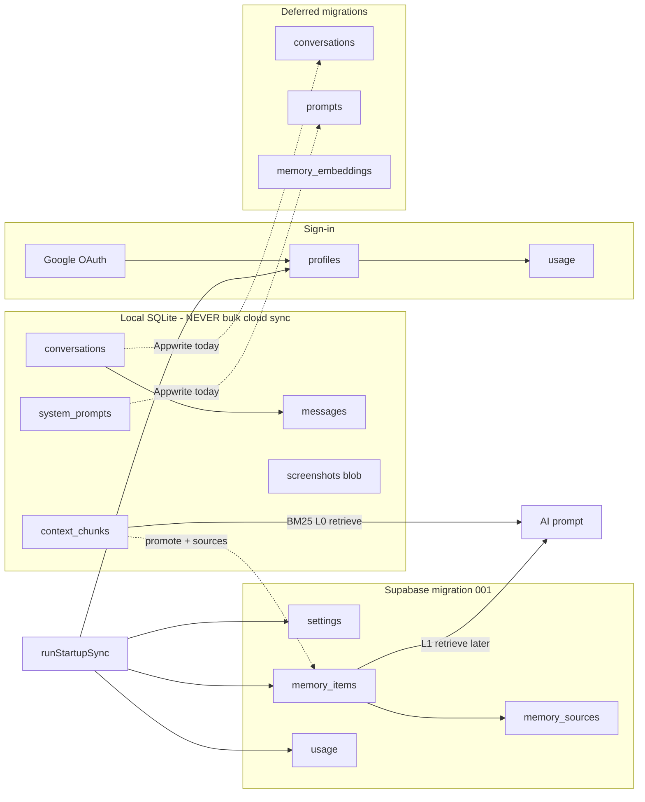

# Supabase Schema Plan — Phase 2 (Option B)

**Project:** Torvi AI — Local-first Context Memory System  
**Date:** June 9, 2026 (revised)  
**Status:** Phase 3 — `supabase/migrations/001_initial_schema.sql` generated  
**Prerequisite:** Phase 0 compatibility layer (`src/lib/backend/`) complete  
**Architecture input:** `docs/context-memory-architecture-review.md` (Option B selected)

---

## Initial migration scope (`001_initial_schema.sql`)

Torvi is a **context memory** product, not a chat-database product. The first Supabase migration includes only account, usage, preferences, and the **memory core**.

### Included in migration 001

| Table | Purpose |
|-------|---------|
| `profiles` | Identity extension, plan |
| `usage` | Server-authoritative billing counters |
| `settings` | Cross-device user preferences |
| `memory_items` | Distilled knowledge (title, tags, content, summary) |
| `memory_sources` | Provenance edges (Option B) |

### Explicitly deferred (later migrations)

| Table | Reason |
|-------|--------|
| `conversations` | Chat UI state — stays local SQLite; Appwrite sync continues until Phase 3+ |
| `prompts` | Prompt library — stays local SQLite + Appwrite until Phase 3+ |
| `messages` | Never synced today; not required for memory vision |
| `memory_embeddings` | Semantic search — add with `vector` extension in dedicated migration |

Appwrite `conversations` / `system_prompts` sync is a **temporary migration bridge only** — do not invest in keeping Appwrite alive long-term. Target steady state: **SQLite (local) + Supabase (cloud)**. Chat list and prompt library stay local in v1; optional `002_chat_sync.sql` only if cross-device chat becomes a hard requirement.

---

## 1. Appwrite Implementation Analysis

### 1.1 Collections & Documents

| Appwrite collection | Document ID strategy | Attributes | Permissions (current) |
|---------------------|---------------------|------------|------------------------|
| `user_profiles` | `userId` (= Appwrite Account `$id`) | `name`, `email`, `plan`, `isActive` | User read+write own doc |
| `user_usage` | `userId` | `aiResponsesUsed`, `listeningSecondsUsed` | User **read-only**; Rust writes via API key |
| `conversations` | Client-generated conv `id` | `userId`, `title`, `createdAt`, `updatedAt` | User read+write own docs — **deferred in Supabase v1** |
| `system_prompts` | `{userId}_sp_{localId}` | `userId`, `name`, `prompt`, `createdAt`, `updatedAt` | User read+write — **deferred in Supabase v1** |
| `user_settings` | `userId` (1:1) | `selectedModel`, `responseLength`, `language`, `systemPrompt` | User read+write own doc → `settings` |
| `screenshot` | Screenshot `id` | `userid`†, `prompt`, `capturedAt`, `storageField` | → `memory_items` + `memory_sources` |

† Typo in Appwrite schema: `userid` (lowercase) — normalize to `user_id` in Supabase.

**Storage bucket:** `screenshots` — deferred in migration 001; screenshot insights map to `memory_items` when opt-in sync ships.

**Not in Appwrite:** Chat message bodies, context memory chunks, screenshot blobs in SQLite, local-only preferences.

### 1.2 SDK & Service Entry Points

| Layer | Files | Operations |
|-------|-------|------------|
| Client SDK | `src/lib/appwrite/client.ts` | `Client`, `Account`, `Databases`, `Storage`, `ping()` |
| Auth | `src/lib/appwrite/auth.ts` | OAuth URL, `createSession`, `get`, `deleteSession`, profile resolve |
| Profiles | `src/lib/appwrite/sync-profiles.ts` | Upsert profile, fetch plan, fetch usage (read) |
| Conversations | `src/lib/appwrite/sync-conversations.ts` | Upsert/delete/list metadata — **Appwrite until deferred tables ship** |
| Settings | `src/lib/appwrite/sync-settings.ts` | Push/pull settings blob → `settings` |
| Prompts | `src/lib/appwrite/sync-prompts.ts` | Upsert/delete/list — **Appwrite until deferred** |
| Screenshots | `src/lib/appwrite/sync-screenshots.ts` | Upload file + metadata doc |
| Orchestration | `src/lib/appwrite/sync.ts` | `runStartupSync()` — plan, usage, settings (+ Appwrite convs/prompts until cutover) |
| Rust usage | `src-tauri/src/usage.rs` | REST PATCH/POST to `user_usage` with `APPWRITE_API_SECRET` |
| Abstraction | `src/lib/backend/*` | App-facing facade (delegates to Appwrite today) |

### 1.3 Authentication Flows

```
Path A — Appwrite Google OAuth (primary)
  Gate → Rust localhost callback server
       → Browser: Appwrite /account/tokens/oauth2/google
       → Callback: ?userId=&secret=&state=
       → account.createSession(userId, secret)
       → resolveUserProfile() → syncUserProfile + initialize_user_usage (Rust)
       → unlock_app → runStartupSync()

Path B — Legacy JWT (fallback)
  Gate → landing page /login?callback_port=
       → Callback: ?token=JWT
       → verifyToken(VITE_API_BASE_URL)
       → unlock_app (no cloud sync unless profile exists)
```

**Supabase implication:** `profiles.id` must equal `auth.users.id` (UUID).

### 1.4 User Data Flows (context-memory centric)



### 1.5–1.9 Local vs cloud (summary)

| Data | Local | Cloud (v1) | Notes |
|------|-------|------------|-------|
| Raw context | `context_chunks` | — | 24h TTL; BM25 L0 |
| Distilled memory | optional cache | `memory_items` + `memory_sources` | Promotion only |
| Chat list + messages | SQLite | — (deferred) | Appwrite metadata sync continues |
| Prompt library | SQLite | — (deferred) | Appwrite sync continues |
| Settings | localStorage | `settings` | v1 |
| Usage | localStorage cache | `usage` | Rust service writes |
| Profile | localStorage cache | `profiles` | Plan authoritative in cloud |

### 1.10 Realtime

Not used today. Optional later for live plan/usage updates.

---

## 2. Migration Mapping

### 2.1 Migration 001 (initial)

| Source | Supabase table | Purpose | Relationships |
|--------|----------------|---------|---------------|
| Account `$id` | `auth.users` | Identity | Parent of all user rows |
| `user_profiles` | `profiles` | Name, plan, active | `profiles.id` → `auth.users.id` |
| `user_usage` | `usage` | Billing counters | `usage.user_id` → `auth.users.id` (1:1) |
| `user_settings` | `settings` | Preferences | `settings.user_id` → `auth.users.id` (1:1) |
| Promoted chunks / insights | `memory_items` | Distilled knowledge | `memory_items.user_id` → `auth.users.id` |
| Capture provenance | `memory_sources` | Attribution edges | `memory_sources.memory_id` → `memory_items.id` |
| `screenshot` doc (opt-in) | `memory_items` + `memory_sources` | Screenshot insight | `source_kind = screenshot` |

### 2.2 Deferred migrations

| Source | Supabase table | Migration |
|--------|----------------|-----------|
| `conversations` doc | `conversations` | `002_chat_sync.sql` (optional) |
| `system_prompts` doc | `prompts` | `002_chat_sync.sql` (optional) |
| SQLite `messages` | `messages` | `003_messages.sql` (optional, likely never) |
| Semantic index | `memory_embeddings` | `004_memory_embeddings.sql` + `vector` ext |

**ID migration note:** Appwrite user IDs are opaque strings; Supabase Auth uses UUID. Use `profiles.legacy_appwrite_id` for ETL or clean break on re-auth.

---

## 3. Supabase Schema Design

### 3.1 Extensions (migration 001 only)

```sql
-- UUID generation (enabled by default on Supabase)
CREATE EXTENSION IF NOT EXISTS pgcrypto;

-- vector extension NOT in 001 — required only for memory_embeddings (deferred)
```

---

### 3.2 `profiles`

| Column | Type | Constraints | Notes |
|--------|------|-------------|-------|
| `id` | `uuid` | **PK**, FK → `auth.users(id)` ON DELETE CASCADE | |
| `email` | `text` | NOT NULL | Denormalized from auth |
| `name` | `text` | NOT NULL DEFAULT `''` | |
| `avatar_url` | `text` | NULL | |
| `plan` | `text` | NOT NULL DEFAULT `'starter'` | CHECK IN (`starter`,`plus`,`pro`,`dev`) |
| `is_active` | `boolean` | NOT NULL DEFAULT `true` | |
| `legacy_appwrite_id` | `text` | UNIQUE NULL | ETL only |
| `created_at` | `timestamptz` | NOT NULL DEFAULT `now()` | |
| `updated_at` | `timestamptz` | NOT NULL DEFAULT `now()` | |

**Indexes:** PK; `idx_profiles_plan`; `idx_profiles_legacy_appwrite_id` (partial).

**RLS:** User SELECT/INSERT/UPDATE own row.

**`plan` protection:** `REVOKE UPDATE (plan) ON profiles FROM authenticated, anon` — users cannot modify `plan` at the column-privilege level; `service_role` (billing/admin) bypasses via `GRANT ALL`. No JWT-inspection trigger.

**Signup hook:** `handle_new_user()` inserts `profiles`, `usage`, `settings` with `ON CONFLICT DO NOTHING` on each — a partial failure or re-sign-in must never block `auth.users` creation.

---

### 3.3 `usage`

| Column | Type | Constraints | Notes |
|--------|------|-------------|-------|
| `user_id` | `uuid` | **PK**, FK → `auth.users(id)` ON DELETE CASCADE | |
| `ai_responses_used` | `integer` | NOT NULL DEFAULT 0, CHECK ≥ 0 | |
| `listening_seconds_used` | `integer` | NOT NULL DEFAULT 0, CHECK ≥ 0 | |
| `period_start` | `date` | NOT NULL DEFAULT `CURRENT_DATE` | |
| `updated_at` | `timestamptz` | NOT NULL DEFAULT `now()` | |

**RLS:** User SELECT only; writes via `increment_usage()` SECURITY DEFINER RPC or service role.

---

### 3.4 `settings`

| Column | Type | Constraints | Notes |
|--------|------|-------------|-------|
| `user_id` | `uuid` | **PK**, FK → `auth.users(id)` ON DELETE CASCADE | |
| `selected_model` | `text` | NOT NULL DEFAULT `'meta-llama/llama-4-maverick:free'` | OpenRouter model ID |
| `response_length` | `text` | NOT NULL DEFAULT `'auto'` | CHECK IN (`short`,`medium`,`auto`) |
| `language` | `text` | NOT NULL DEFAULT `'English'` | |
| `system_prompt` | `text` | NOT NULL DEFAULT `''` | Max 10_000 chars in app before push |
| `updated_at` | `timestamptz` | NOT NULL DEFAULT `now()` | |

**RLS:** `(select auth.uid()) = user_id` for ALL.

---

### 3.5 `memory_items` (Option B — revised)

Distilled knowledge nodes. **Provenance lives in `memory_sources`**, not on this row.

| Column | Type | Constraints | Notes |
|--------|------|-------------|-------|
| `id` | `uuid` | **PK** DEFAULT `gen_random_uuid()` | |
| `user_id` | `uuid` | NOT NULL, FK → `auth.users(id)` ON DELETE CASCADE | |
| `title` | `text` | NOT NULL DEFAULT `''` | Short display label (e.g. window title, user edit) |
| `tags` | `text[]` | NOT NULL DEFAULT `'{}'` | User/system tags for filter + retrieval |
| `content` | `text` | NOT NULL | Full distilled body |
| `summary` | `text` | NULL | LLM short form for injection / cards |
| `knowledge_type` | `text` | NOT NULL DEFAULT `'reference'` | Ontology: `fact`, `procedure`, `decision`, `reference`, `preference`, `event` |
| `domain` | `text` | NOT NULL DEFAULT `'generic'` | Facet: `code`, `meeting`, `email`, `browser`, `people`, `project`, `generic` |
| `importance` | `smallint` | NOT NULL DEFAULT 5 CHECK 1–10 | Rank weight |
| `created_by` | `text` | NOT NULL DEFAULT `'user'` | `user`, `ai`, `import`, `connector` — who/what created this memory |
| `content_hash` | `text` | NULL | SHA-256 dedup; **UNIQUE per user** on active rows (`WHERE deleted_at IS NULL`) |
| `confirmed_at` | `timestamptz` | NULL | Last staleness confirmation |
| `metadata` | `jsonb` | NOT NULL DEFAULT `'{}'` | `storage_path`, UI hints — not provenance |
| `created_at` | `timestamptz` | NOT NULL DEFAULT `now()` | |
| `updated_at` | `timestamptz` | NOT NULL DEFAULT `now()` | |
| `deleted_at` | `timestamptz` | NULL | Soft delete — **hard-purged after 30 days** (see §3.7) |

**Deferred from v1** (add when project/workspace memory ships): `scope_type`, `scope_id`.

**Removed from item** (moved to `memory_sources`): `source`, `source_app`, `source_url`, `memory_type` (split into `knowledge_type` + `domain` + `source_kind` on sources).

**Indexes:**

- PK on `id`
- `idx_memory_user_updated` on `(user_id, updated_at DESC)`
- `idx_memory_user_domain` on `(user_id, domain)`
- `idx_memory_user_knowledge_type` on `(user_id, knowledge_type)`
- `idx_memory_user_importance` on `(user_id, importance DESC, updated_at DESC)`
- `idx_memory_user_content_hash_unique` UNIQUE on `(user_id, content_hash)` WHERE `content_hash IS NOT NULL AND deleted_at IS NULL`
- `idx_memory_tags` GIN on `tags`
- `idx_memory_search` GIN on `to_tsvector('english', coalesce(title,'') || ' ' || coalesce(summary,'') || ' ' || content)` — keyword L1 retrieval without embeddings

**RLS:**

| Policy | Operation | Rule |
|--------|-----------|------|
| `memory_select_own` | SELECT | `(select auth.uid()) = user_id` AND `deleted_at IS NULL` |
| `memory_insert_own` | INSERT | `(select auth.uid()) = user_id` |
| `memory_update_own` | UPDATE | `(select auth.uid()) = user_id` |
| `memory_delete_own` | DELETE | `(select auth.uid()) = user_id` |

**Soft-delete retention:** Rows with `deleted_at` set are hard-deleted after **30 days** via `purge_deleted_memories()` (callable by pg_cron or Edge Function).

**RLS performance:** All policies use `(select auth.uid())` instead of bare `auth.uid()` per [Supabase RLS best practices](https://supabase.com/docs/guides/troubleshooting/rls-performance-and-best-practices-Z5Jjwv).

**Promotion rule:** Raw `context_chunks` never bulk-upload. User stars / saves → insert `memory_items` + one or more `memory_sources` rows.

---

### 3.6 `memory_sources` (Option B — new)

Provenance edges: where a memory came from. 1 memory : N sources.

| Column | Type | Constraints | Notes |
|--------|------|-------------|-------|
| `id` | `uuid` | **PK** DEFAULT `gen_random_uuid()` | |
| `memory_id` | `uuid` | NOT NULL | |
| `user_id` | `uuid` | NOT NULL, FK → `auth.users(id)` ON DELETE CASCADE | Must match memory owner |
| `source_kind` | `text` | NOT NULL | `local_chunk`, `screen_capture`, `screenshot`, `chat_excerpt`, `meeting`, `browser_tab`, `connector`, `manual` |
| `source_ref` | `text` | NULL | Opaque **local** ID (`context_chunks.id`) — not raw text |
| `connector` | `text` | NULL | `slack`, `notion`, `gmail`, … when `source_kind = connector` |
| `connector_ref` | `text` | NULL | External stable ID (thread TS, page ID) |
| `app_name` | `text` | NULL | From capture pipeline |
| `window_title` | `text` | NULL | |
| `content_type` | `text` | NULL | `code`, `meeting`, `email`, … |
| `url` | `text` | NULL | Browser / document URL |
| `captured_at` | `timestamptz` | NULL | When source was observed |
| `excerpt` | `text` | NULL | Short approved slice (≤2_000 chars), not full capture |
| `metadata` | `jsonb` | NOT NULL DEFAULT `'{}'` | Connector-specific payload |
| `created_at` | `timestamptz` | NOT NULL DEFAULT `now()` | |

**Indexes:**

- `idx_memory_sources_memory_id` on `(memory_id)`
- `idx_memory_sources_user_captured` on `(user_id, captured_at DESC)`
- `idx_memory_sources_user_kind` on `(user_id, source_kind)`
- `idx_memory_sources_connector` on `(user_id, connector, connector_ref)` WHERE `connector IS NOT NULL`
- `idx_memory_sources_local_ref` on `(user_id, source_ref)` WHERE `source_ref IS NOT NULL`

**Ownership FK:** Composite `FOREIGN KEY (memory_id, user_id) REFERENCES memory_items(id, user_id)` — prevents attaching sources to another user's memory even if RLS `user_id` matches the caller.

**RLS:** `(select auth.uid()) = user_id` for ALL.

**Cardinality:**

- One promoted memory from a meeting may have 12 `local_chunk` sources + 1 `connector` source.
- Same `source_ref` may appear on multiple memories over time (re-promotion after edit).

---

## 4. Table Relationship Diagram (migration 001)

```mermaid
erDiagram
    auth_users ||--|| profiles : "id"
    auth_users ||--|| usage : "user_id"
    auth_users ||--o| settings : "user_id"
    auth_users ||--o{ memory_items : "user_id"
    auth_users ||--o{ memory_sources : "user_id"
    memory_items ||--o{ memory_sources : "memory_id"

    auth_users {
        uuid id PK
        text email
    }

    profiles {
        uuid id PK_FK
        text name
        text plan
    }

    usage {
        uuid user_id PK_FK
        int ai_responses_used
        int listening_seconds_used
    }

    settings {
        uuid user_id PK_FK
        text selected_model
        text system_prompt
    }

    memory_items {
        uuid id PK
        uuid user_id FK
        text title
        text_array tags
        text content
        text summary
        text knowledge_type
        text domain
        smallint importance
    }

    memory_sources {
        uuid id PK
        uuid memory_id FK
        text source_kind
        text source_ref
        text app_name
        text url
        timestamptz captured_at
    }
```

**Deferred (not in diagram):** `conversations`, `prompts`, `messages`, `memory_embeddings`, `memory_links`, `workspaces`.

---

## 5. Deferred table designs (not in migration 001)

### 5.1 `conversations` + `messages` (optional `002_chat_sync.sql`)

Chat metadata and message backup remain **local-first**. Only add if cross-device chat list is a product requirement.

<details>
<summary>Schema sketch — expand when needed</summary>

**`conversations`:** `id text PK`, `user_id uuid FK`, `title`, `created_at`, `updated_at`, `deleted_at`.

**`messages`:** `id text PK`, `conversation_id FK`, `user_id FK`, `role`, `content`, `attached_files jsonb`, `timestamp`.

Both: RLS `(select auth.uid()) = user_id`.

</details>

### 5.2 `prompts` (optional `002_chat_sync.sql`)

Named prompt library — today synced via Appwrite + local SQLite. Defer until memory infrastructure is live.

<details>
<summary>Schema sketch</summary>

`id uuid PK`, `user_id FK`, `name`, `prompt`, `local_sqlite_id`, `legacy_appwrite_doc_id`, timestamps.

</details>

### 5.3 `memory_embeddings` (optional `004_memory_embeddings.sql`)

Semantic L1 retrieval. Requires `vector` extension + embedding pipeline.

| Column | Type | Notes |
|--------|------|-------|
| `memory_id` | `uuid` PK FK → `memory_items` | |
| `embedding` | `vector(N)` | N matches chosen model |
| `model` | `text` | |
| `created_at` | `timestamptz` | |

HNSW index on `embedding`. Until this ships, L1 retrieval uses `tsvector` GIN on `memory_items` (included in 001).

---

## 6. Data Placement Strategy

### A. Local SQLite only

| Data | Store | Rationale |
|------|-------|-----------|
| Raw context | `context_chunks` | Privacy; 24h TTL; BM25 L0 |
| Chat messages | `messages` | Local-first |
| Chat list | `conversations` | Local-first (v1) |
| Prompt library | `system_prompts` | Local-first (v1) |
| Screenshot binary | `screenshots.image_data` | Large; offline-first |
| BYOK keys | localStorage | Never cloud |

### B. Supabase only (migration 001)

| Data | Table |
|------|-------|
| Identity | `auth.users` |
| Plan | `profiles.plan` |
| Usage counters | `usage` |
| Distilled memory | `memory_items` |
| Provenance | `memory_sources` |

### C. Synced

| Data | Local | Cloud (v1) | Direction |
|------|-------|------------|-----------|
| Settings | localStorage | `settings` | Bidirectional |
| Profile cache | localStorage | `profiles` | Pull; cloud plan wins |
| Usage display | localStorage | `usage` | Pull + Rust ratchet push |
| Promoted memories | optional cache | `memory_items` + `memory_sources` | Cloud authoritative |
| Conversations | SQLite | — (deferred) | Appwrite until cutover |
| Prompts | SQLite | — (deferred) | Appwrite until cutover |

---

## 7. Retrieval architecture

| Tier | Corpus | Method | Migration |
|------|--------|--------|-----------|
| **L0 Live** | `context_chunks` (local) | BM25 + recency | Exists today |
| **L1 Long-term** | `memory_items` (cloud) | `tsvector` + tags + importance | **Migration 001** |
| **L1 Semantic** | `memory_embeddings` | pgvector hybrid | **Deferred** (`004`) |

Merge at query time: L0 for “on screen now”; L1 for “what do I know about X”.

---

## 8. Sync Strategy (Supabase v1)

### 8.1 Startup sync

1. `profiles` + `usage` — authoritative pull  
2. `settings` — pull + merge  
3. `memory_items` + `memory_sources` — pull last 90 days  
4. **Skip** conversations/prompts (still Appwrite or local only)

### 8.2 Write triggers

| Event | Action |
|-------|--------|
| Sign-in | Upsert profile, init usage, pull settings + memories |
| Save to memory | Insert `memory_items` + `memory_sources` |
| Settings change | Push `settings` |
| Context capture | Local only — **no cloud** |
| AI response / listening | Rust `increment_usage` |
| Conversation / prompt CRUD | **Local SQLite only** — Appwrite sync deprecated; remove during cutover |

---

## 9. Appwrite `screenshot` → memory mapping

| Appwrite | Supabase (when opt-in sync ships) |
|----------|-----------------------------------|
| `screenshot` doc | `memory_items` (`domain=browser` or `generic`, `knowledge_type=reference`) |
| Analysis text | `summary` or `content` |
| `prompt` field | `metadata.analysis_prompt` |
| Capture context | `memory_sources` (`source_kind=screenshot`, `excerpt`, `captured_at`) |
| Storage file | `metadata.storage_path` + Storage bucket (deferred) |

---

## 10. Migration Risks

| Risk | Severity | Mitigation |
|------|----------|------------|
| User ID format change | High | `legacy_appwrite_id`; re-auth or ETL |
| Usage counter loss | High | Dual-write during cutover |
| Chat/prompt sync gap during transition | Low | Local SQLite is sufficient; Appwrite bridge is short-lived only |
| `source_ref` meaningless on other devices | Expected | Show “captured on another device” |
| PII in distilled memory | High | Redaction before promotion; opt-in screenshot cloud |
| `plan` self-escalation | High | Column-level `REVOKE UPDATE (plan)` for authenticated; service_role only |
| Auth signup blocked by trigger | Medium | `handle_new_user()` uses `ON CONFLICT DO NOTHING` on all seed inserts |
| Cross-user source attachment | High | Composite FK `(memory_id, user_id)` → `memory_items` |
| Tags array unbounded | Low | App cap e.g. 20 tags × 64 chars |

---

## 11. Suggested Migration Order

| Step | Migration / work | Tables |
|------|------------------|--------|
| 1 | **`001_initial_schema.sql`** | `profiles`, `usage`, `settings`, `memory_items`, `memory_sources` + RLS + `increment_usage()` |
| 2 | Auth + Supabase provider in `src/lib/backend` | — |
| 3 | Rust `usage.rs` → Supabase RPC | `usage` |
| 4 | Promotion UX (star chunk → memory + sources) | `memory_items`, `memory_sources` |
| 5 | ETL Appwrite profiles/usage/settings | — |
| 6 | `002_chat_sync.sql` *(optional)* | `conversations`, `prompts` |
| 7 | `003_messages.sql` *(optional, unlikely)* | `messages` |
| 8 | `004_memory_embeddings.sql` | `memory_embeddings` + `vector` ext |
| 9 | Storage bucket for screenshot files | Storage + metadata |
| 10 | Remove Appwrite | Phase 6 |

---

## 12. Environment Variables (future)

| Remove (Phase 6) | Add |
|------------------|-----|
| `VITE_APPWRITE_*` | `VITE_SUPABASE_URL` |
| `APPWRITE_API_SECRET` | `VITE_SUPABASE_ANON_KEY` |
| | `SUPABASE_SERVICE_ROLE_KEY` (Rust only) |
| | `VITE_BACKEND_PROVIDER=appwrite\|supabase` |

---

## 13. Approval Checklist Before `001_initial_schema.sql`

- [x] Option B: `memory_sources` included
- [x] `title` + `tags` on `memory_items`
- [x] `conversations`, `prompts`, `messages`, `memory_embeddings` excluded from 001
- [x] `created_by` on `memory_items`
- [x] `scope_type` / `scope_id` deferred (not in 001)
- [x] Soft-delete purge after 30 days (`purge_deleted_memories()`)
- [x] RLS uses `(select auth.uid())` pattern
- [x] Signup trigger: `ON CONFLICT DO NOTHING` on profile/usage/settings seed
- [x] `plan` protected via column `REVOKE`, not JWT trigger
- [x] `memory_sources` composite FK enforces memory ownership
- [x] `content_hash` UNIQUE per user on active rows
- [ ] Promotion UX: manual only in v1 (recommended)
- [ ] Screenshot cloud sync: opt-in (recommended)
- [ ] User ID strategy: clean break vs ETL

**Deliverable:** `supabase/migrations/001_initial_schema.sql` — **ready to execute** (Phase 3).

**V1 tradeoff (accepted):** `memory_items` serves as both knowledge store and memory store. Split into `knowledge_items` later if needed — not a Phase 3 problem.

---

## 14. What This Document Does NOT Include

- Supabase project provisioning (run migration in dashboard or CLI after creating project)
- Application code changes
- Appwrite removal
- `memory_links` / `workspaces` (Company Brain Phase 3+)
